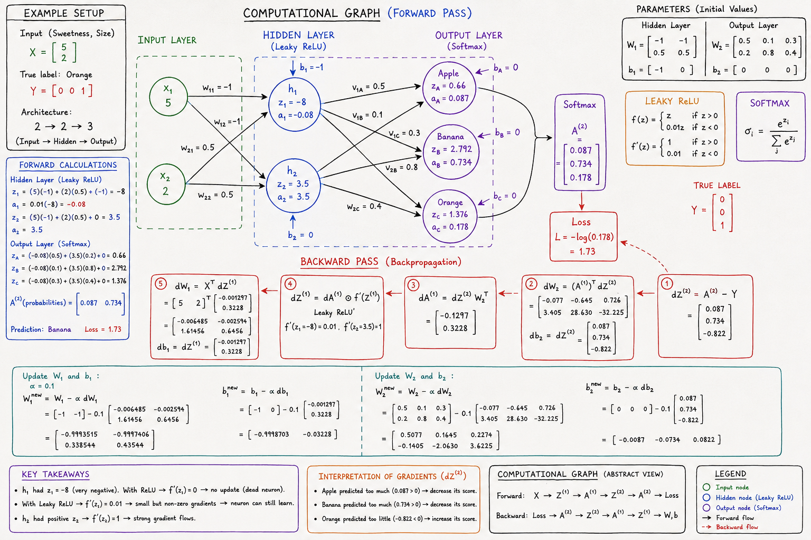

# N-Layer Neural Network From Scratch



A complete implementation of an **N-Layer Neural Network** built entirely from scratch using **NumPy**.

No TensorFlow.
No PyTorch.
No Keras.

The goal of this project is to understand what happens inside a neural network by implementing every component manually:

- Forward Propagation
- Backpropagation
- Gradient Descent
- Softmax
- Cross Entropy Loss
- ReLU / Leaky ReLU
- Weight Updates
- Multi-Class Classification

---

## Neural Network Architecture

The project demonstrates the complete computational graph of a neural network including:

1. Input Layer
2. Hidden Layers
3. Activation Functions
4. Output Layer
5. Loss Computation
6. Backpropagation
7. Gradient Descent Updates

---

## Why Build a Neural Network From Scratch?

Modern frameworks abstract away most of the mathematics behind neural networks.

This project was built to answer questions such as:

- How does forward propagation work?
- How is loss calculated?
- How does backpropagation compute gradients?
- Why does the chain rule matter?
- Why do vanishing gradients occur?
- Why are ReLU and Leaky ReLU important?
- How do weights actually get updated?

By implementing everything manually, the learning process becomes much more intuitive.

---

## Features

### Forward Propagation

For every layer:

```math
Z^{[l]} = A^{[l-1]}W^{[l]} + b^{[l]}
```

```math
A^{[l]} = g(Z^{[l]})
```

---

### Activation Functions

Implemented:

- Sigmoid
- Tanh
- ReLU
- Leaky ReLU
- Softmax

---

### Loss Functions

#### Binary Cross Entropy

```math
L = -(y\log(\hat y)+(1-y)\log(1-\hat y))
```

#### Categorical Cross Entropy

```math
L = -\sum y_i\log(\hat y_i)
```

---

### Backpropagation

Gradients are calculated manually using the Chain Rule.

Example:

```math
\frac{\partial L}{\partial W}
=
\frac{\partial L}{\partial A}
\cdot
\frac{\partial A}{\partial Z}
\cdot
\frac{\partial Z}{\partial W}
```

---

### Gradient Descent

```math
W_{new}
=
W_{old}
-
\alpha
\frac{\partial L}{\partial W}
```

---

## Project Structure

```text
.
├── neural_network.py
├── activations.py
├── losses.py
├── utils.py
├── train.py
├── N_Layered_Neural_Network_Image.png
├── README.md
```

---

## Training Workflow

```text
Input Data
      │
      ▼
Forward Propagation
      │
      ▼
Predictions
      │
      ▼
Cross Entropy Loss
      │
      ▼
Backpropagation
      │
      ▼
Gradient Computation
      │
      ▼
Weight Update
      │
      ▼
Repeat
```

---

## Computational Graph

The neural network is treated as a computational graph.

Forward pass:

```text
X
↓
Z1
↓
A1
↓
Z2
↓
A2
↓
Loss
```

Backward pass:

```text
Loss
↑
A2
↑
Z2
↑
A1
↑
Z1
↑
Weights
```

Backpropagation simply traverses this graph in reverse while applying the Chain Rule.

---

## Vanishing Gradient Problem

The project explores why activation functions such as:

- Sigmoid
- Tanh

can cause gradients to become extremely small in deep networks.

```math
0 < \sigma'(z) < 1
```

Repeated multiplication of these derivatives causes gradients to shrink exponentially.

---

## Dying ReLU Problem

For ReLU:

```math
ReLU(z)=max(0,z)
```

Derivative:

```math
ReLU'(z)=
\begin{cases}
1 & z > 0\\
0 & z \le 0
\end{cases}
```

When neurons become permanently negative:

```math
ReLU'(z)=0
```

No gradients flow backward.

The neuron stops learning.

---

## Leaky ReLU Solution

```math
LeakyReLU(z)
=
\begin{cases}
z & z > 0\\
\alpha z & z \le 0
\end{cases}
```

This allows gradients to continue flowing even for negative activations.

---

## Future Improvements

- Xavier Initialization
- He Initialization
- Mini Batch Gradient Descent
- Momentum
- RMSProp
- Adam Optimizer
- Dropout
- Batch Normalization
- L2 Regularization
- CNN From Scratch
- Transformer Components From Scratch

---

## Learning Objectives

This project is intended to help understand:

- Neural Networks
- Matrix Multiplication
- Computational Graphs
- Chain Rule
- Gradient Descent
- Deep Learning Foundations

rather than simply using existing frameworks.

---

## References

- Deep Learning by Ian Goodfellow
- Neural Networks and Deep Learning by Michael Nielsen
- CS231n - Stanford University
- Deep Learning Specialization - Andrew Ng

---

## Author

Ranjan Mondal

Built as part of a deep dive into Neural Networks and Deep Learning fundamentals with the goal of understanding modern AI systems from first principles.